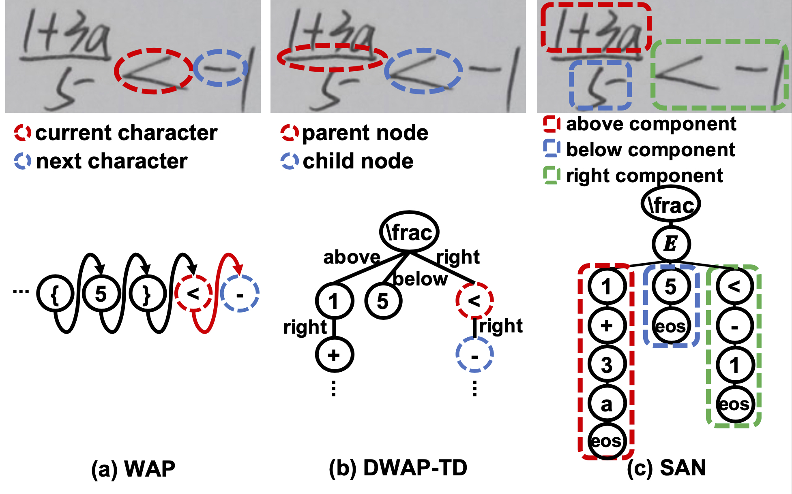

# Syntax-Aware Network for Handwritten Mathematical Expression Recognition

SAN is an accurate handwritten mathematical expression recognizer. The research paper can be found [here](https://arxiv.org/abs/2203.01601).



### Install

```
pip install -r requirement.txt
```

### Train

```
python train.py --config path_to_config_yaml
```

### Inference
```
python inference.py --config path_to_config_yaml --image_path path_to_image_folder --label_path path_to_label_folder
```

```
Example:
python inference.py --config 14.yaml --image_path data/14_test_images --label_path data/test_caption.txt
```

### Dataset

CROHME: 
```
You can download the dataset from: https://github.com/JianshuZhang/WAP/tree/master/data
```

HME100K
```
You can download the dataset from the official website: https://ai.100tal.com/dataset
```

### Citation

If you find this dataset helpful for your research, please cite the following paper:

```
@article{yuan2022syntax,
  title={Syntax-Aware Network for Handwritten Mathematical Expression Recognition},
  author={Yuan, Ye and Liu, Xiao and Dikubab, Wondimu and Liu, Hui and Ji, Zhilong and Wu, Zhongqin and Bai, Xiang},
  journal={arXiv preprint arXiv:2203.01601},
  year={2022}
}
```